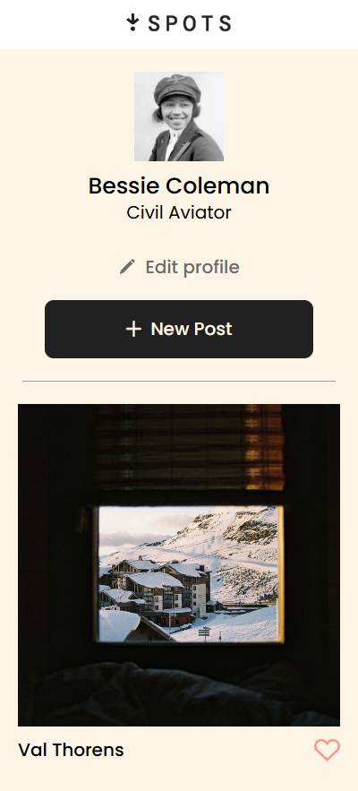
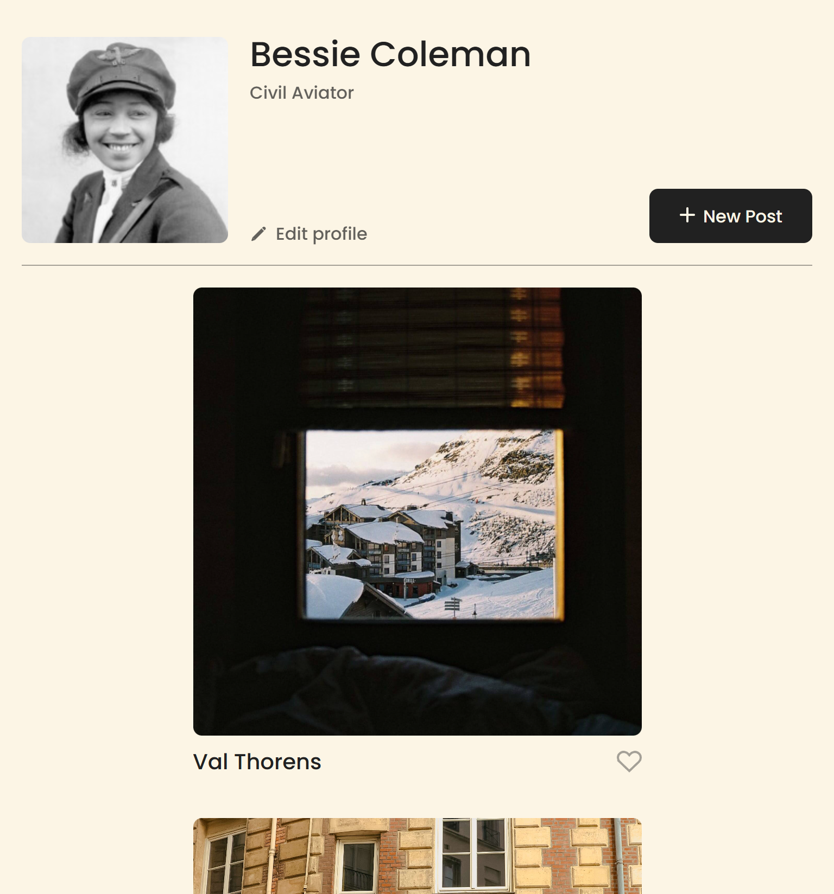

# Project 3: Spots

### Overview

An image sharing site. Providing users with an opportunity to share and discover places around the world.

## Tech Stack

- HTML
- CSS
- Responsive Design
- DOT
- Developer tools in Chrome

## Making webpage responsive through different devices

The `@media screen and (max-width: 627px)` block is a CSS **media query** which is used to apply styles only when the screen has a maximum width of 627 pixels.

```css
@media screen and (max-width: 627px) {
  .cards__list {
    grid-template-columns: repeat(auto-fit, 288px);
    gap: 20px 12px;
  }
}
```

This allows for the elements in the site to be organized on screen depending on the device the user is on.




## Deployment

https://needless1745.github.io/se_project_spots/

## Link to video

https://drive.google.com/file/d/1XoRFT1mjjkgJEODHgji8qVLRmVfcRMO1/view?usp=sharing
